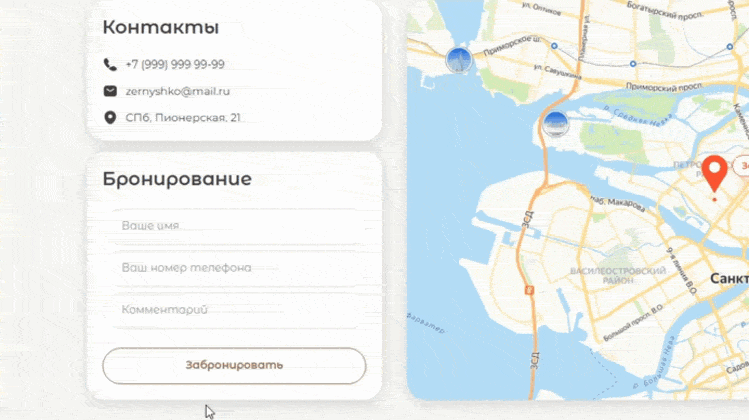

# Лендинг кофейни «Зернышко»

Добро пожаловать в проект «Зернышко» — стильный лендинг кофейной тематики.
<div align="center">
  
</div>

## Описание
Coffee-House — это статический лендинг кофееной тематики, разработанный с использованием HTML, CSS и JavaScript. Проект служит отличным примером создания привлекательного одностраничного сайта (лендинга), который содержит основную информацию о кофе, меню, а также форму для оформления заказа с проверкой корректности введённых данных.

В текущей версии лендинг не адаптивен, ориентирован на просмотр с десктопных устройств и предназначен для демонстрации навыков фронтенд-верстки и базовой логики на JavaScript.

## Использованные технологии
- HTML5 — семантическая разметка структуры лендинга и организация контента
- CSS3 — стилизация элементов для создания приятного и чистого дизайна
- JavaScript (ES6) — управление интерактивностью и пользовательским опытом

## Функционал
- Одностраничный лендинг с тематическим контентом о кофе и меню
- Форма заказа с обязательной валидацией полей, обеспечивающая корректность пользовательского ввода
- Стильный дизайн, подчёркивающий уникальность кофейной тематики
- Совместимость со всеми популярными браузерами
- Плавная прокрутка к соответствующим разделам при выборе пунктов навигационного меню
- Плавное переключение блоков с карточками при нажатии на кнопки в разделе меню
- Интерактивное переключение карточек и плавная прокрутка к разделам в зависимости от выбора изображений в верхней части сайта
- Интеграция карт с использованием API и написание базового кода на JavaScript для управления отображением
- Скрытие управляющих элементов карт с помощью JavaScript
- Удаление копирайтов на странице через стили CSS

<div align="center">
  
</div>

## Запуск проекта локально

1. Клонируй репозиторий к себе на компьютер:
```
git clone https://github.com/ASHWAGANDHUM/Coffee-House.git
```                

2. Перейди в папку проекта:
```
cd Coffee-House`
```

3. Открой файл `index.html` в любом современном браузере (дважды клик по файлу или через меню браузера «Открыть файл»).  

> Проект не требует установки дополнительных серверов или сборок, так как реализован на HTML и CSS с минимальным JavaScript.

## Возможные улучшения
- Сделать лендинг адаптивным для корректного отображения на мобильных устройствах и планшетах
- Интегрировать форму заказа с backend для обработки и хранения данных
- Добавить базу данных для сохранения заказов и расширения функционала
- Подключить API платёжных систем для приёма онлайн-платежей через сайт
  
## Деплой  
Сайт доступен онлайн по ссылке: 
[https://ashwagandhum.github.io/Coffee-House/](https://ashwagandhum.github.io/Coffee-House/)

## Контакты

По вопросам и предложениям можно связаться через [мой Телеграм.](https://t.me/aarrggeennttuumm)

---

Спасибо, что посетили проект!
